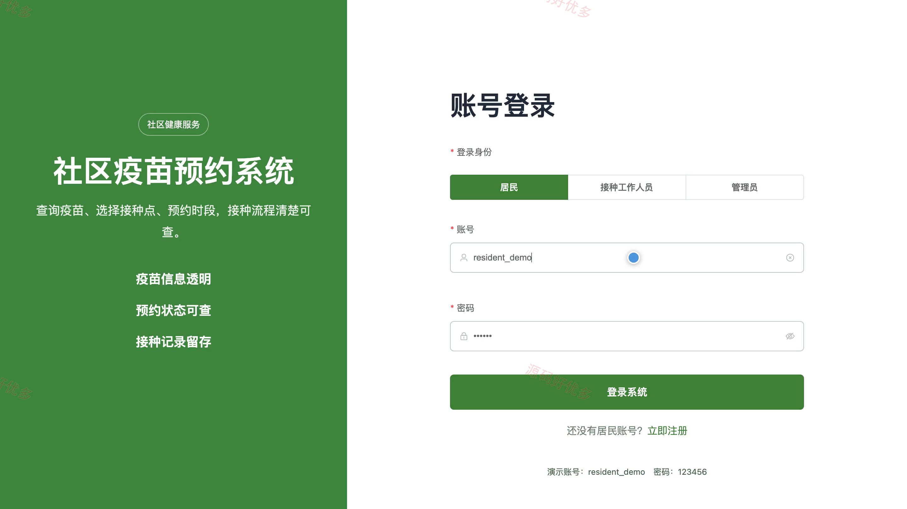
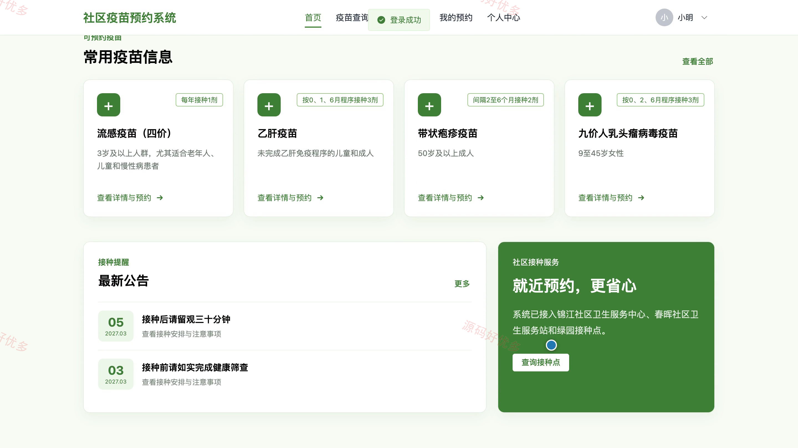
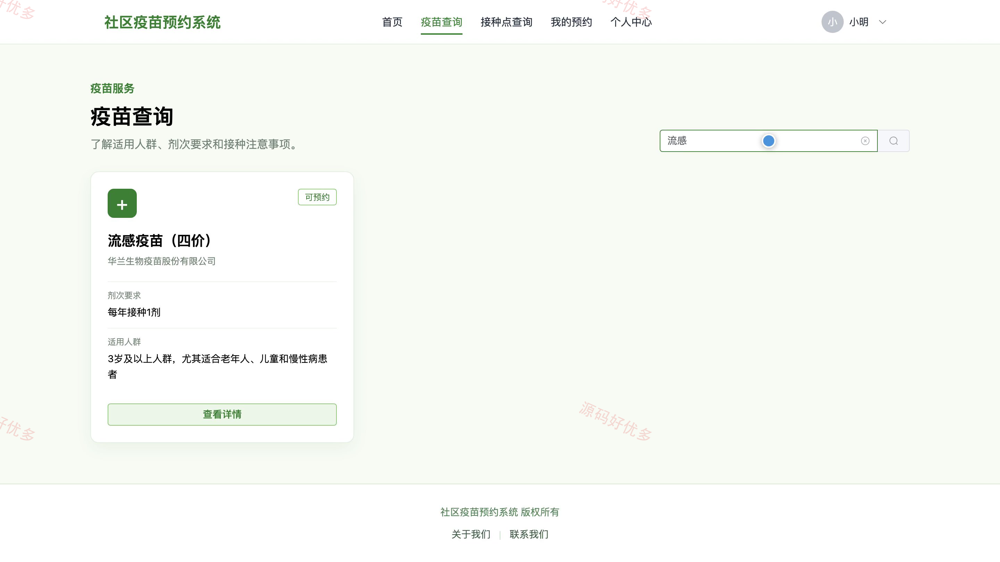
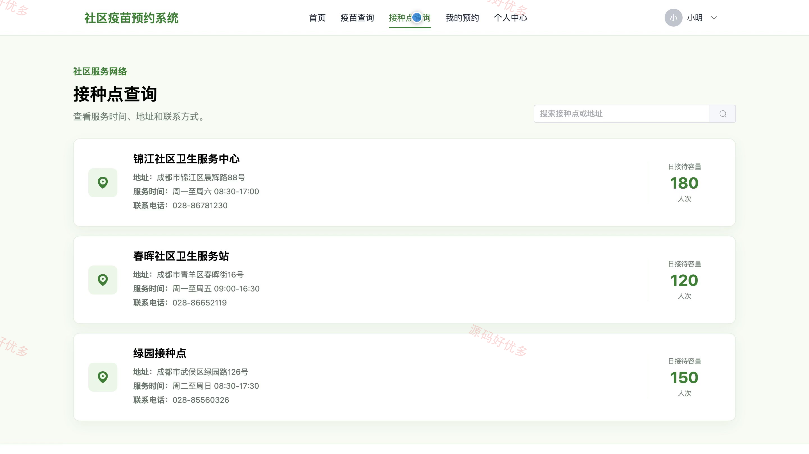
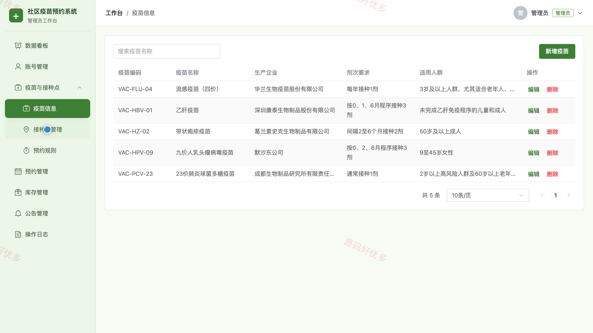
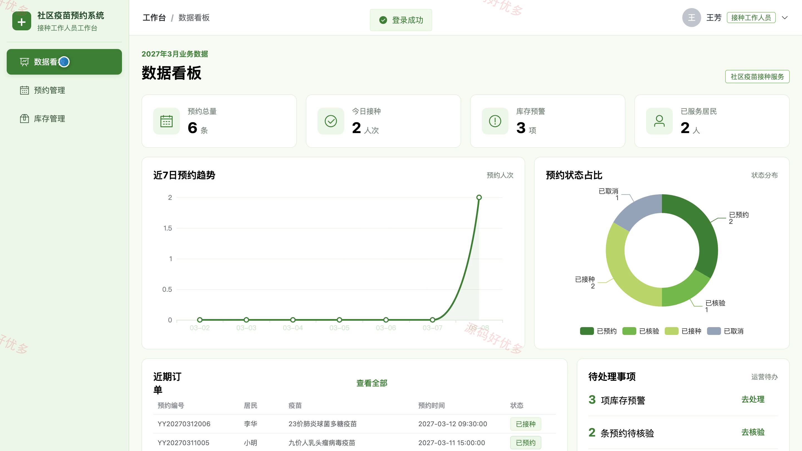
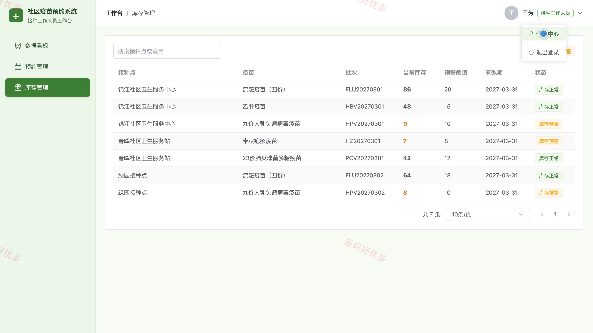
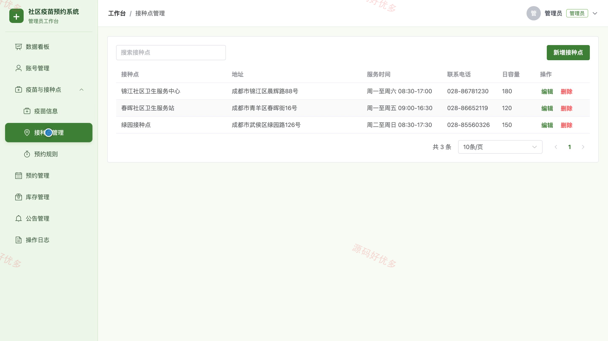

# bs056A
bs056A社区疫苗预约系统
## 源码问题查看主页咨询

### 一、关键词
社区疫苗预约、预防接种服务、疫苗接种预约、接种点查询、疫苗库存管理

### 二、作品包含
源码+数据库+全套环境和工具资源+本地部署教程

### 三、项目技术
前端技术： Html、Css、Js、Vue3.4、Element-Plus
后端技术：Java、SpringBoot3.2.0、MyBatis-Plus

### 四、运行环境（以下版本亲测，其他版本兼容性请自行测试）
开发工具：IDEA/eclipse + VSCODE

数据库：MySQL5.7+（共11张表）

数据库管理工具：Navicat10以上版本

环境配置软件： JDK17 + Maven

前端Nodejs：20

浏览器：谷歌浏览器

### 五、项目介绍
项目编号：bs056A

社区疫苗预约系统面向居民、接种工作人员和管理员，提供疫苗与接种点查询、在线预约、预约核验、接种登记、库存维护和预约规则管理等功能，并支持公告服务、账号维护和业务数据查看。

角色：居民、接种工作人员、管理员

居民功能：注册登录、疫苗查询与详情查看、接种点查询、在线预约申请、个人预约查询与取消、接种公告查看、个人资料与密码维护。

接种工作人员功能：业务数据看板、预约信息管理、预约核验、接种登记、疫苗库存管理、个人资料维护。

管理员功能：业务数据看板、账号管理、疫苗信息管理、接种点管理、预约规则管理、预约与接种管理、库存管理、公告及操作日志管理。

### 六、运行截图

